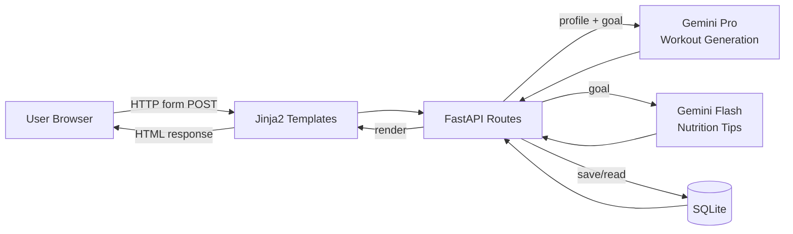

# 🏋️ FitBuddy — AI Fitness Plan Generator

> Your personalized 7-day workout companion, powered by Google Gemini AI.

---

## 📖 Overview

**FitBuddy** is a web application that uses Google's Gemini AI models to generate personalized 7-day workout plans and nutrition/recovery tips from a user's basic profile (age, weight, fitness goal, workout intensity). Users can submit feedback to have their plan intelligently revised, and an admin view lists every user with their original and updated plans side by side.

---

## ✨ Features

- 🏋️ **Generate Plan** — Enter your profile and receive a structured 7-day workout plan with warm-ups, exercises (sets/reps/duration), and cooldowns
- 🔄 **Feedback Loop** — Submit feedback on your existing plan and get an AI-revised version, with the original preserved for comparison
- 🥗 **Nutrition Tips** — Every plan includes a concise, goal-aligned nutrition or recovery tip
- 👥 **Admin Dashboard** — View all users with their profile data, original plan, and updated plan for progress tracking

---

## 🛠️ Tech Stack

| Layer | Technology |
|---|---|
| Backend | FastAPI |
| ASGI Server | Uvicorn |
| AI Models | Google Gemini (`gemini-3.5 flash` for plans, `gemini-3.6-flash` for tips) the other models like 3.1 pro preview are rate limited and exhausted in free tier usage |
| Templating | Jinja2 |
| ORM / DB | SQLAlchemy + SQLite |
| Validation | Pydantic |
| Frontend | HTML5, CSS3 (Flexbox/Grid), Vanilla JS |
| Env Management | python-dotenv |

---

## 🏛️ Architecture



The app follows a server-rendered MVC pattern. FastAPI handles routing and orchestration, delegating AI prompt construction to dedicated modules and data persistence to SQLAlchemy. Jinja2 templates render the final HTML. The AI layer is fully server-side — no API keys or prompts are exposed to the browser.

---

## 📁 Project Structure

```
fitbuddy/
├── app/
│   ├── main.py
│   ├── routes.py
│   ├── database.py
│   ├── schemas.py
│   ├── gemini_generator.py
│   ├── gemini_flash_generator.py
│   └── updated_plan.py
├── templates/
│   ├── index.html
│   ├── result.html
│   └── all_users.html
├── static/
│   ├── css/style.css
│   ├── js/main.js
│   └── images/
├── .env
├── .env.example
├── requirements.txt
├── fitbuddy.db
└── README.md
```

---

## 🚀 Setup & Installation

```bash
# Clone the repository
git clone <repo-url>
cd fitbuddy

# Create virtual environment
python -m venv venv
source venv/bin/activate        # Windows: venv\Scripts\activate

# Install dependencies
pip install -r requirements.txt

# Configure environment
cp .env.example .env
# Edit .env and add your Google API key: GOOGLE_API_KEY=your_key_here

# Run the application
uvicorn app.main:app --reload
```

- **Web Application**: [http://127.0.0.1:8000](http://127.0.0.1:8000)
- **Interactive API Documentation**: [http://127.0.0.1:8000/docs](http://127.0.0.1:8000/docs)

---

## 🔌 API Endpoints

| Method | Path | Description |
|---|---|---|
| `GET` | `/` | Landing page with workout form |
| `POST` | `/generate-workout` | Generate a 7-day workout plan |
| `POST` | `/submit-feedback` | Submit feedback to revise plan |
| `GET` | `/view-all-users` | Admin dashboard |
| `POST` | `/delete-user/{user_id}` | Delete a user |

---

## 🗄️ Database Schema

### **Users Table**
- `id` (INTEGER, Primary Key, Autoincrement)
- `user_id` (TEXT, Unique, Indexed)
- `name` (TEXT)
- `age` (INTEGER)
- `weight` (FLOAT)
- `goal` (TEXT)
- `intensity` (TEXT)
- `created_at` (DATETIME)

### **Plans Table**
- `id` (INTEGER, Primary Key, Autoincrement)
- `user_id` (TEXT, Foreign Key -> `users.user_id`)
- `original_plan` (TEXT)
- `updated_plan` (TEXT, Nullable)
- `nutrition_tip` (TEXT, Nullable)
- `feedback` (TEXT, Nullable)
- `created_at` (DATETIME)
- `updated_at` (DATETIME)

---

## 🔮 Future Improvements

- 🔐 User authentication and login system
- ☁️ Cloud deployment (Google Cloud Run, Railway)
- 📄 PDF export of workout plans
- 📊 Progress tracking charts and analytics
- 🏃 Exercise demonstration videos/GIFs
- 🌐 Multi-language support

---

